# Dom Manipulation Assignment


1. Webiste Name: [Dev To](https://dev.to/)

### Topics

    - Query Selctory, Inner HTML

### Sample Image


### Tasks

        Target the Top description div and change the DEV Community to <Your_Name> and description to your passion

### Output

    document.querySelector(".side-bar .crayons-card h2").innerHTML =
    "Battu V Revanth";
    document.querySelector(".side-bar .crayons-card p").innerHTML =
    "Aspiring JavaScript Fullstack Developer";

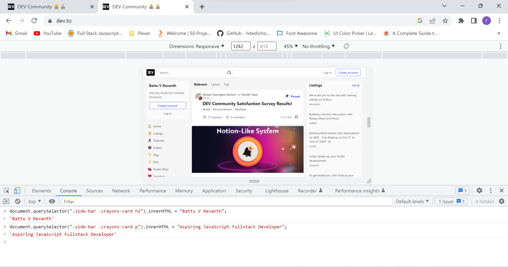

2. Website Name: [Apple](https://support.apple.com/en-in)

### Task


### Fetch all the product name and store in an array

### Output

     let arr = [];
     let elements = document.querySelectorAll(".as-imagegrid-item");
     for (let i = 0; i < elements.length; i++) {
     arr.push(elements[i].innerText.replace("\nSupport", ""));
     }
     console.log(arr);

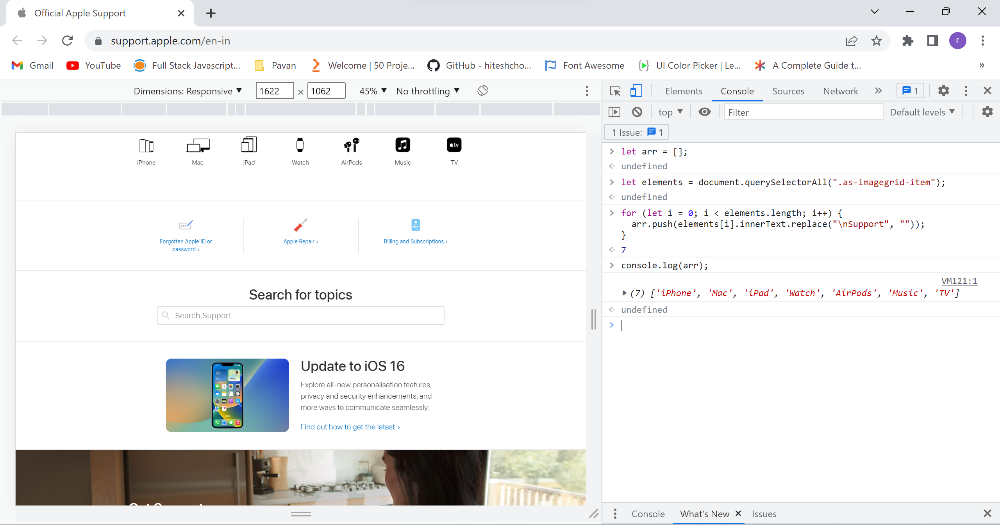

['iPhone', 'Mac', 'iPad', 'Watch', 'AirPods', 'Music', 'TV']

3. Webiste Name: [Youtube Support](https://support.google.com/youtube/)

### Topics

    - Get Element By Id, Create Element, Create Text Node, Append Child

### Sample Image


### Tasks

     Add another FAQ 'My New FAQ' to the list

### Output

```
let newSec = document.createElement("section");
newSec.classList.add("parent");
let faq = document.createElement("h3");
faq.innerText = "My New FAQ";
newSec.appendChild(faq);
document.querySelector(".accordion-homepage").appendChild(newSec);
```

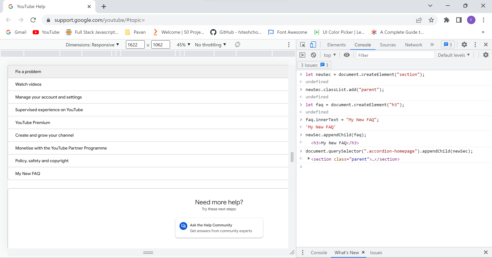

4. Webiste Name: [OnePlus](https://www.oneplus.in/support)

### Topics

     Query Selector, InnerText

### Sample Image


### Tasks

      Change the contact number

### Output

```
document.querySelector(".customer-support .one-tel-number").innerText =
  "9448022338";
```

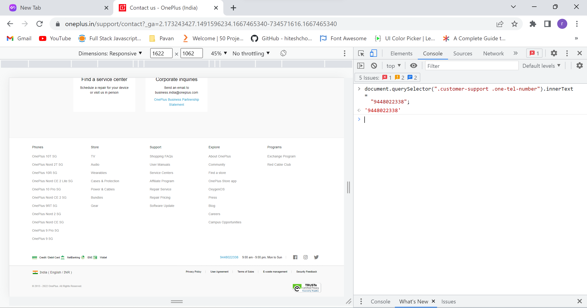

5. Webiste Name: [Samsung](https://www.samsung.com/in/offer/online/samsung-fest/)

### Topics

       getElementById, createElement, InnerText, append, setAttribute

### Sample Image


### Tasks

     Target the main div of card and change the Button text to Check out

### Output

```
document.querySelector(
  "#smartphone-deals .diwali-deals-product-sale-pro .diwali-deals-product-sale-btn"
).innerText = "Check out";
```

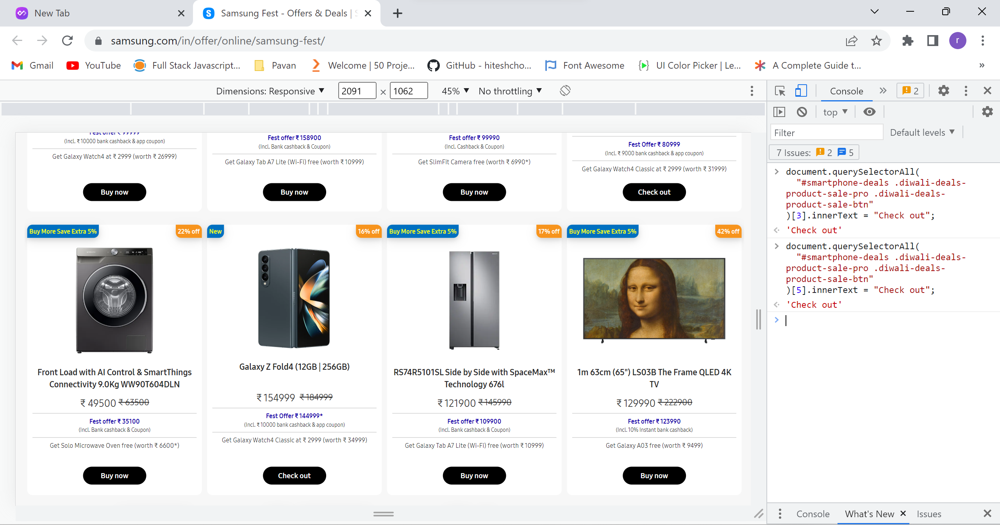

6. Webiste Name: [Adidas](https://www.adidas.co.in/)

### Topics

    -   Query Selector, Event listeners, Changing Styles

### Sample Image


### Tasks

     Target the search box and on hover change thebackground color to red.

### Output

```
function hover() {
  document.querySelector(".searchinput___19uW0").style.backgroundColor = "Red";
}
document.addEventListener("mouseover", hover);
```

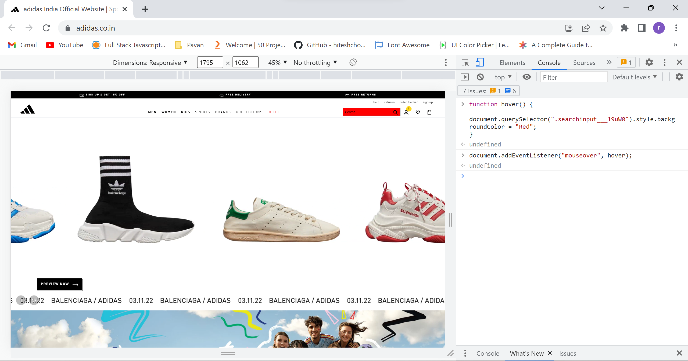

7. Webiste Name: [MDN Web Docs](https://developer.mozilla.org/en-US/)

### Topics

       Form, Value, Submit

### Sample Image


### Tasks

     To Search a topic in the MDN Search bar.
     First add a text to search in the search bar and then hit the submit search button to search the docs using DOM

### Output

```
function wordSearch(Text) {
  let search = document.querySelector("#top-nav-search-input");
  search.value = Text;
  let form = document.querySelector("#top-nav-search-form");
  form.submit();
}
wordSearch("function");
```

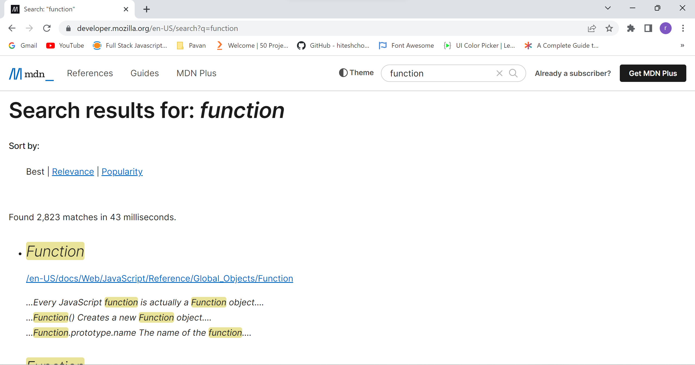

8. Webiste Name: [Google](https://www.google.com/)

### Topics

       Remove Elements

### Sample Image


### Tasks

     Remove alternate languages from the home page languages listed

### Output

```
let langs = document.querySelectorAll("#SIvCob a");
function del(langs) {
  for (let i = 0; i < langs.length; i += 2) {
    langs[i].remove();
  }
}
del(langs);
```

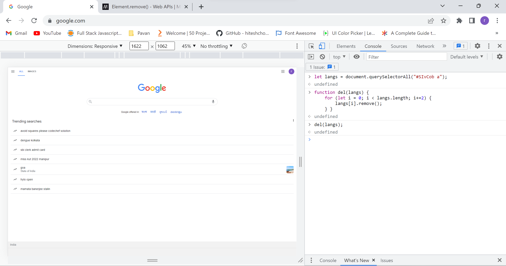

9. Webiste Name: [Code Wars](https://www.codewars.com/)

### Topics

       Change Font Family, Color of Text.

### Sample Image


### Tasks

    Change the font family of the text to monospace and text color to the logo’s background color.

### Output

```
document.querySelector("h1").style.color = "#b44040";
document.querySelector("h1").style.fontFamily = "monospace";
```

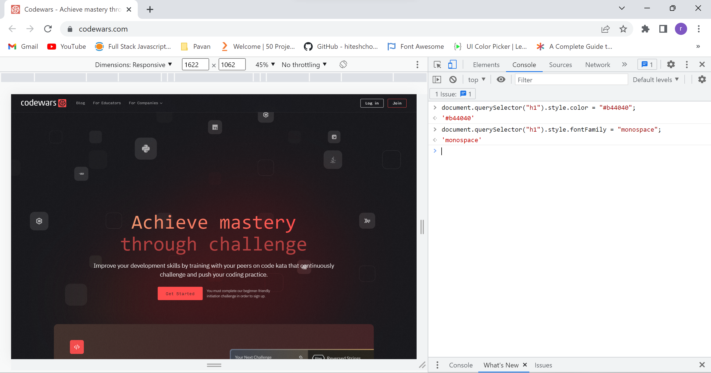

10. Webiste Name: [Freecodecamp](https://www.freecodecamp.org/)

### Topics

       querySelector, mouseover, click eventListener,  callback function, style,

### Sample Image


### Tasks

    Target the button and change background colour on mouseover

### Output

```
let clrChange = document.querySelector(".btn-cta-big .login-btn-text");
function bgChange() {
  clrChange.style.backgroundColor = "red";
}
clrChange.addEventListener("mouseover", bgChange);
```

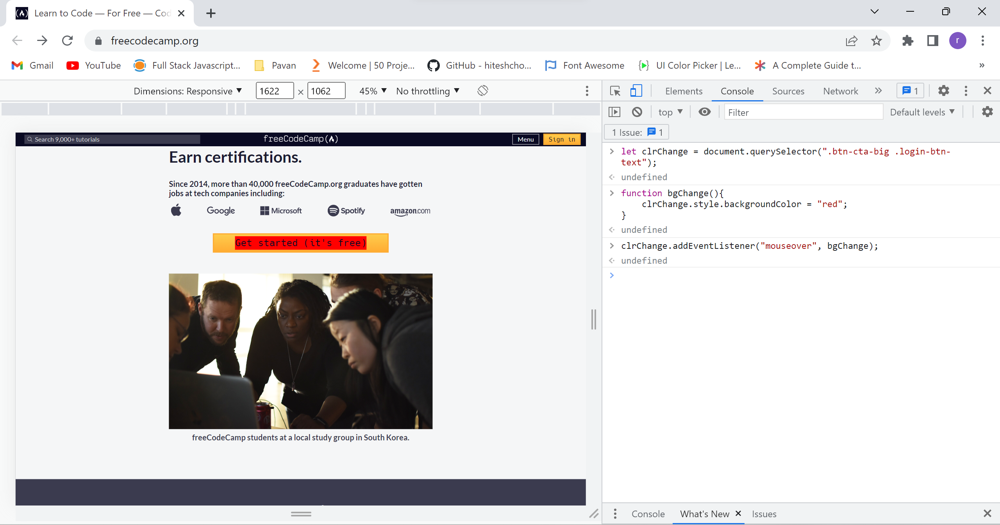

11. Webiste Name: [realme](https://www.realme.com/in/)

### Topics

       querySelector,style,background-image

### Sample Image


### Tasks

    change the realme logo to ineuron logo

### Output

```
let logo = document.querySelector(".wrapper .logo .icon");
logo.style.backgroundImage = "url(https://ineuron.ai/images/ineuron-logo.png)";

```

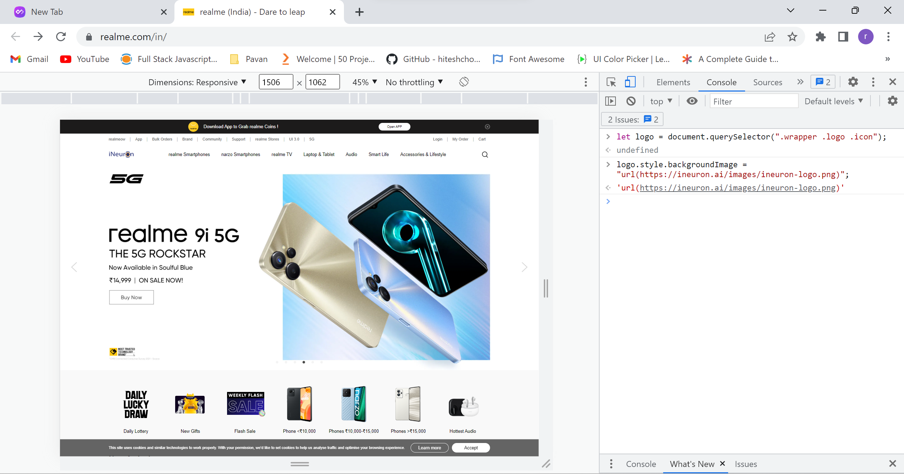

12. Webiste Name: [Github](https://github.com/)

### Topics

       querySelector,style,background-Color

### Sample Image


### Tasks

     change the background colour of the button to blue.

### Output

```
let btnClr = document.querySelector(".col-sm-6 button");
btnClr.style.backgroundColor = "blue";
```

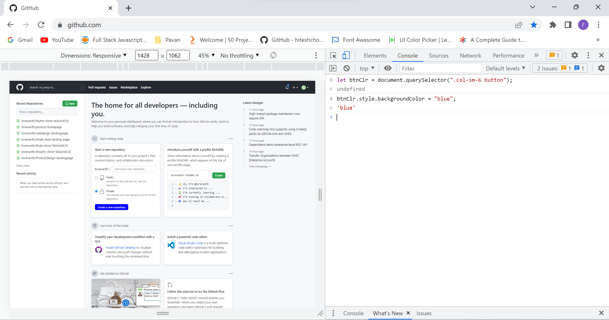

13. Webiste Name: [Hackerrank](https://www.hackerrank.com/)

### Topics

       querySelector,innerHtml

### Sample Image


### Tasks

Target the top description and change “Matching developers with great companies” to ‘JSBOOTCAMP“.

### Output

```
document.querySelector(".fl-rich-text span").innerHTML = "JSBOOTCAMP";
```

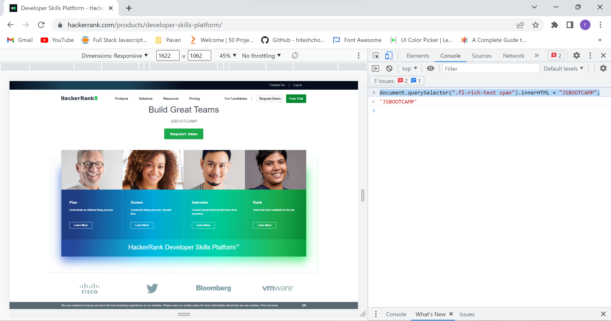

14. Webiste Name: [Asus](https://www.asus.com/in/)

### Topics

      querySelector,style,font-size

### Sample Image


### Tasks

       change the fontsize of “Hot Deals” to 80px

### Output

```
document.querySelector(".HotDealsAll__Heading__2fIbe").style.fontSize = "80px";
```

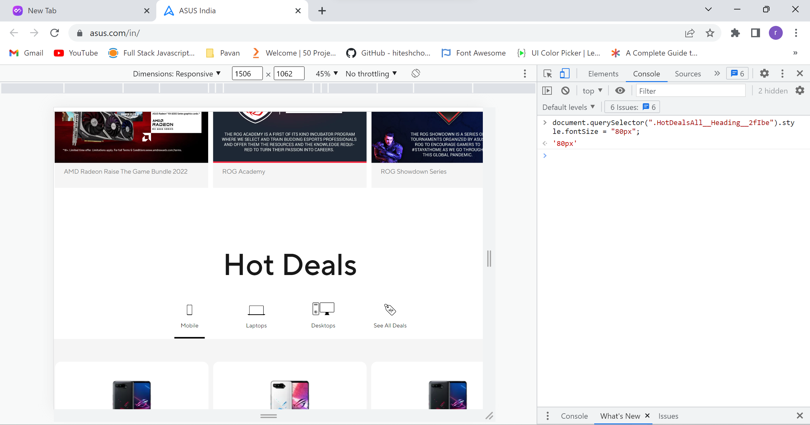

15. Webiste Name: [Dell](https://www.dell.com/en-in/shop/deals/laptop-deals?gacd=10415953-9016-5761040-285981356-0&dgc=ST&gclid=Cj0KCQjwguGYBhDRARIsAHgRm4-XUDMhhVNyHXb3s1gY4ZBzORr_d9Se-buhJwy7asyUe7YdqEA11eEaAt6UEALw_wcB&gclsrc=aw.ds&nclid=BxjBlpBQsX6pjSHh-L8YYSU77EpfXRkG1AGMB5Wbeu386ykspfrPDnfx_DdFau20)

### Topics

      querySelector,style.textAlign

### Sample Image


### Tasks

       Convert the text “G15 Gaming Laptop” from left to right

### Output

```
document.querySelectorAll(".ps-top .ps-title")[4].style.textAlign = "right";
```

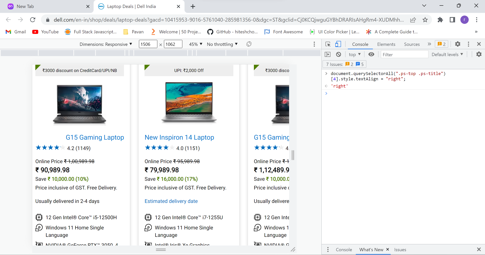

16. Webiste Name: [Vercel](https://vercel.com/)

### Topics

     querySelector,innerHTMl

### Sample Image


### Tasks

      change the heading “Start with the developer” to “Start with Scratch”

### Output

```
document.querySelector(".geist-wrapper .section-title_title__VEDfK").innerHTML =
  "Start with Scratch";
```

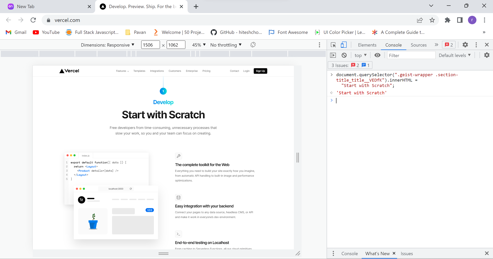

17. Webiste Name: [Sony](https://www.sony.co.in/)

### Topics

    querySelector,innerHTMl

### Sample Image


### Tasks

     change the button text To current Date.

### Output

```
let button = document.querySelector(".span4 .btn-container");
let curDate = new Date();
button.innerText = curDate;
```

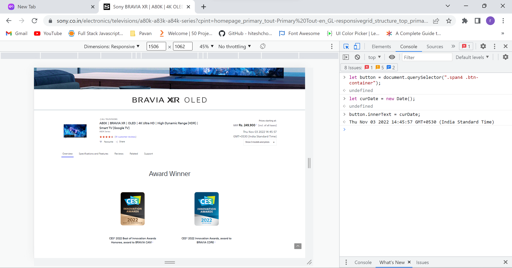

18. Webiste Name: [Philips](https://www.philips.co.in/)

### Topics

     querySelector,style,backgroundcolor

### Sample Image

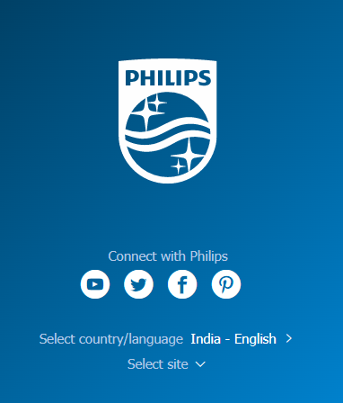

### Tasks

    change the background colour blue to orange

### Output

```
document.querySelector(".p-footer").style.backgroundColor = "orange";

```

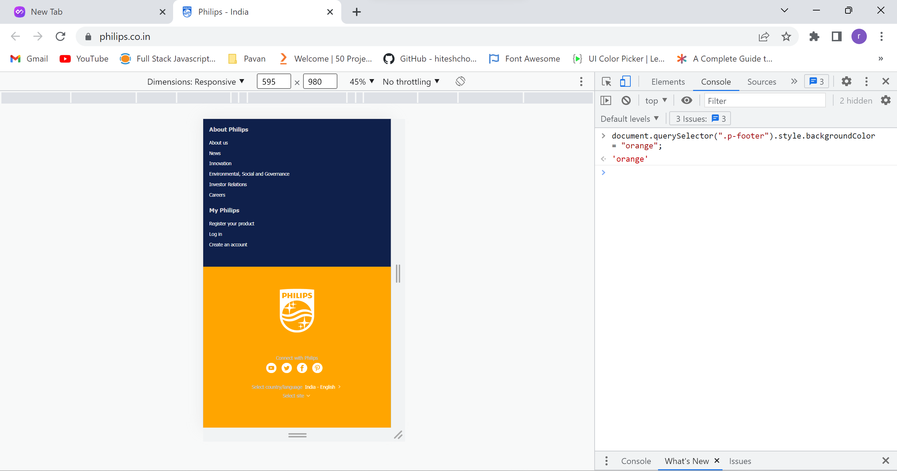

19. Webiste Name: [Canon](https://in.canon/)

### Topics

          querySelector,src

### Sample Image


### Tasks

    extract the canon logo

### Output

```
let logo = document.querySelector(".navbar-brand .logo").src;
console.log(logo);
```

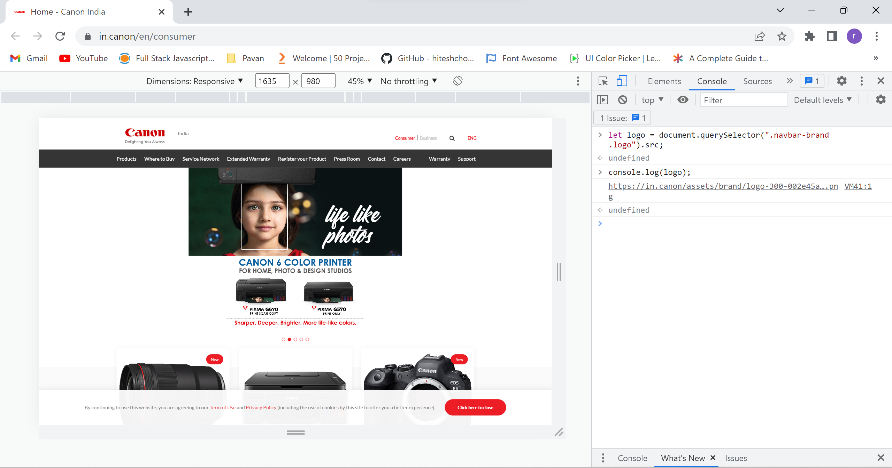

20. Webiste Name: [Oppo](https://www.oppo.com/in/)

### Topics

          querySelector,style,color

### Sample Image


### Tasks

      Change the description colour black to orange

### Output

```
let clrChange = document.querySelector(".wide h3");
clrChange.style.color = "orange";
```

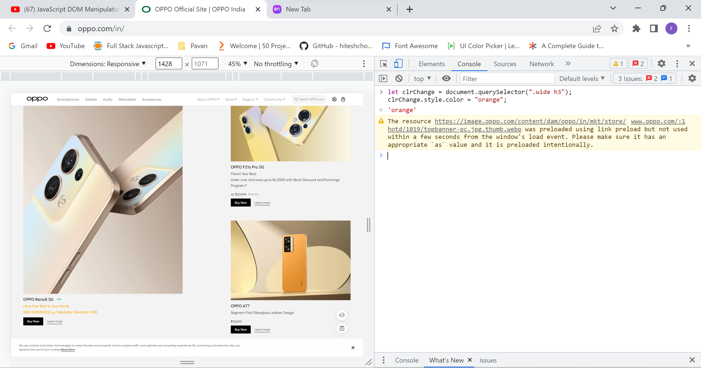
